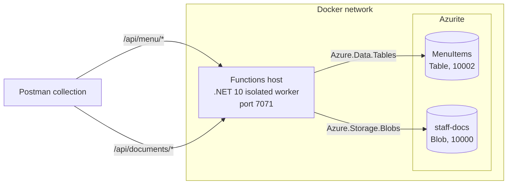

 CoffeeNChill Canteen Management System — Part 1

Cloud Development B (CLDV6212/w) · Portfolio of Evidence · Part 1

Eight HTTP-triggered Azure Functions over Azure Table Storage and Blob Storage,
running against the Azurite emulator and packaged as a Docker image. Menu items
live in a `MenuItems` table; staff documents live in a `staff-docs` blob
container.

## Contributions

| Student | Work |
| --- | --- |
| ST10450884 | Table and blob services, the eight HTTP functions, Dockerfile |
| ST10472017 | API reference, Postman collection and environment, documentation |
| ST10472312 | |

## Architecture



One Functions host serves all eight routes on one port. `TableStorageService`
and `BlobStorageService` wrap the storage SDKs; the functions handle HTTP and
delegate to them.

The brief specifies an Azure File Share for staff documents, but Azurite
supports only the Blob, Queue and Table services (Microsoft, 2026b), so
`staff-docs` is a blob container.

## Prerequisites

- Docker Desktop
- .NET 10 SDK
- Azure Functions Core Tools v4
- Postman

## Running locally

Start Azurite:

```bash
docker run -d --name azurite \
  -p 10000:10000 -p 10001:10001 -p 10002:10002 \
  mcr.microsoft.com/azure-storage/azurite
```

Create `local.settings.json` in the repository root:

```json
{
  "IsEncrypted": false,
  "Values": {
    "AzureWebJobsStorage": "UseDevelopmentStorage=true",
    "FUNCTIONS_WORKER_RUNTIME": "dotnet-isolated"
  }
}
```

Start the host:

```bash
func start
```

All eight routes are listed at startup. Optionally seed sample data:

```bash
bash docs/seed-menu.sh
```

## Running in Docker

```bash
docker build -t coffeenchill-functions:v1.0 .
docker network create coffeenchill-net

docker run -d --name azurite --network coffeenchill-net \
  -p 10000:10000 -p 10001:10001 -p 10002:10002 \
  mcr.microsoft.com/azure-storage/azurite

docker run -d --name functions --network coffeenchill-net \
  -p 7071:80 coffeenchill-functions:v1.0
```

Build with `--platform linux/amd64` on an Apple Silicon machine so the image
runs on x86_64 hosts.

## Endpoints

| Method | Route | Success | Failure |
| --- | --- | --- | --- |
| POST | `/api/menu` | 201 | 400 |
| GET | `/api/menu` | 200 | — |
| GET | `/api/menu/category/{category}` | 200 | — |
| PUT | `/api/menu/{category}/{id}` | 200 | 400, 404 |
| DELETE | `/api/menu/{category}/{id}` | 200 | 404 |
| POST | `/api/documents/upload?fileName=` | 201 | 400 |
| GET | `/api/documents` | 200 | — |
| GET | `/api/documents/download/{fileName}` | 200 | 404 |

Request and response shapes are in [`docs/api-contract.md`](docs/api-contract.md).

## Testing

`docs/CoffeeNChill.postman_collection.json` holds 23 requests across three
folders, carrying 78 assertions. Every request resolves its address from the
`{{baseUrl}}` environment variable.

Import the collection and `docs/CoffeeNChill-Local.postman_environment.json`,
select the environment, then run the collection. From the command line:

```bash
newman run docs/CoffeeNChill.postman_collection.json \
  -e docs/CoffeeNChill-Local.postman_environment.json
```

The run is repeatable: the create request clears its own key beforehand and the
delete request removes it at the end.

The three upload requests read files from `docs/test-files`. Re-select them in
Postman if the path does not resolve after import.

## References

Chai, 2026. *Expect / Should*. Chai Assertion Library. [Online]
Available at: <https://www.chaijs.com/api/bdd/> [Accessed 14 September 2026].

Microsoft, 2026a. *Azure Tables client library for .NET*. [Online]
Available at: <https://learn.microsoft.com/en-us/dotnet/api/overview/azure/data.tables-readme>
[Accessed 14 September 2026].

Microsoft, 2026b. *Use the Azurite emulator for local Azure Storage development*. [Online]
Available at: <https://learn.microsoft.com/en-us/azure/storage/common/storage-use-azurite>
[Accessed 14 September 2026].

Postman, 2026a. *Test examples in Postman*. [Online]
Available at: <https://learning.postman.com/docs/tests-and-scripts/write-scripts/test-examples/>
[Accessed 14 September 2026].

Postman, 2026b. *Store and reuse values using variables*. [Online]
Available at: <https://learning.postman.com/docs/sending-requests/variables/variables/>
[Accessed 14 September 2026].

Postman, 2026c. *Use scripts to send requests in Postman*. [Online]
Available at: <https://learning.postman.com/docs/tests-and-scripts/write-scripts/postman-sandbox-reference/pm-send-request/>
[Accessed 14 September 2026].

Postman, 2026d. *Postman Sandbox API reference*. [Online]
Available at: <https://learning.postman.com/docs/tests-and-scripts/write-scripts/postman-sandbox-api-reference/>
[Accessed 14 September 2026].
